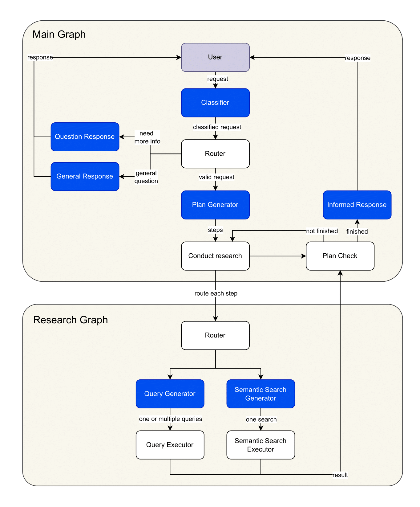

# Meal Planner GraphRAG

## Overview

Meal Planner GraphRAG is an AI-powered meal planning assistant that leverages a Neo4j graph database, semantic search, and LLM-driven reasoning to generate personalized recipe recommendations and shopping lists. The system is designed for flexibility, supporting complex dietary constraints, ingredient mapping, and efficient retrieval from a rich recipe/product knowledge graph.

## Architecture


## Features

- **Personalized Recipe Search:** Find recipes based on dietary needs, time, calories, difficulty, and more.
- **Semantic & Query Search:** Combines semantic similarity and precise graph queries for robust retrieval.
- **Shopping List Generation:** Maps recipe ingredients to real store products.
- **Multi-step Reasoning:** Uses LLMs to plan and execute multi-step retrieval strategies.
- **Evaluation Framework:** Tools for evaluating retrieval plans and outputs.
- **Containerized Deployment:** Docker and Docker Compose support for easy setup.

## Project Structure

```
.
├── app/                # Main application code (API, prompts, logic, utils)
│   ├── core/           # Core logic (prompts, state graph, etc.)
│   ├── logic/          # Business logic
│   ├── public/         # Static/public assets
│   ├── utils/          # Utility functions
│   ├── app.py          # Application entry point
│   ├── config.py       # Configuration
│   └── requirements.txt
├── neo4j/              # Neo4j initialization scripts and entrypoint
├── evaluation/         # Evaluation notebooks and datasets
├── docs/               # Documentation and images
├── docker-compose.yml  # Docker Compose configuration
└── README.md           # Project documentation
```

## How It Works

1. **User Intent Understanding:** The system uses LLM prompts to clarify user needs and constraints.
2. **Research Plan Generation:** Generates a step-by-step plan using semantic and query search to retrieve relevant recipes/products from Neo4j.
3. **Cypher Query Generation:** Translates plan steps into Cypher queries, leveraging the graph schema.
4. **Recipe & Product Retrieval:** Executes queries to find recipes and map ingredients to store products.
5. **Shopping List Creation:** Optionally generates a shopping list tailored to the selected recipes.
6. **Evaluation:** Provides tools to evaluate the quality and correctness of retrieval plans.

## Getting Started

### Prerequisites

- Docker & Docker Compose
- Python 3.10+
- OpenAI API key (for LLM features)
- Neo4j (runs in Docker)

### Setup

1. **Clone the repository:**
   ```sh
   git clone <repo-url>
   cd meal-planner-graphrag
   ```

2. **Configure environment variables:**
  - Example environment files are provided as `.env.example` and `.env-docker.example` in the `app/` directory, and `.env.neo4j.example` in the `neo4j/` directory.
  - To configure your environment:
    1. Copy the example files to their active counterparts:
      ```sh
      cp app/.env.example app/.env
      cp app/.env-docker.example app/.env-docker
      cp neo4j/.env-docker.example neo4j/.env-docker
      ```
    2. Edit these files to set your API keys, database credentials, Neo4j settings, and other configuration as needed.
  - These files are required for both local development and Docker-based deployment.


3. **Start Neo4j and the app:**
   ```sh
   docker-compose up --build
   ```

4. **Access the application:**
   - The app will be available at `http://localhost:8501`
   - The neo4j database will be available at `http://localhost:7474`

### Development

- Main application logic is in [`app/app.py`](app/app.py).
- Prompts and LLM logic are in [`app/core/prompts.py`](app/core/prompts.py).
- Evaluation tools are in [`evaluation/`](evaluation/).

### Example Usage

- **Recipe Search:**  
  Ask for "Quick vegetarian breakfast recipes under 30 minutes" and the system will generate a research plan, execute Cypher queries, and return curated recipes.
- **Shopping List:**  
  After selecting recipes, request a shopping list to get mapped store products.

## Key Components

- [`app/core/prompts.py`](app/core/prompts.py):  
  Contains prompt templates for research plan generation, review, and Cypher query generation.
- [`app/core/state_graph/nodes/main_graph/create_research_plan.py`](app/core/state_graph/nodes/main_graph/create_research_plan.py):  
  Implements research plan review and optimization.
- [`neo4j/init.cypher`](neo4j/init.cypher):  
  Initializes the Neo4j database schema and sample data.

## Evaluation

- Use [`evaluation/eval.ipynb`](evaluation/eval.ipynb) to assess the quality of generated research plans and retrieval outputs.